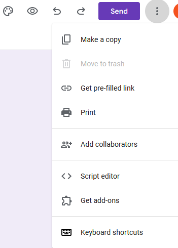
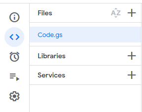
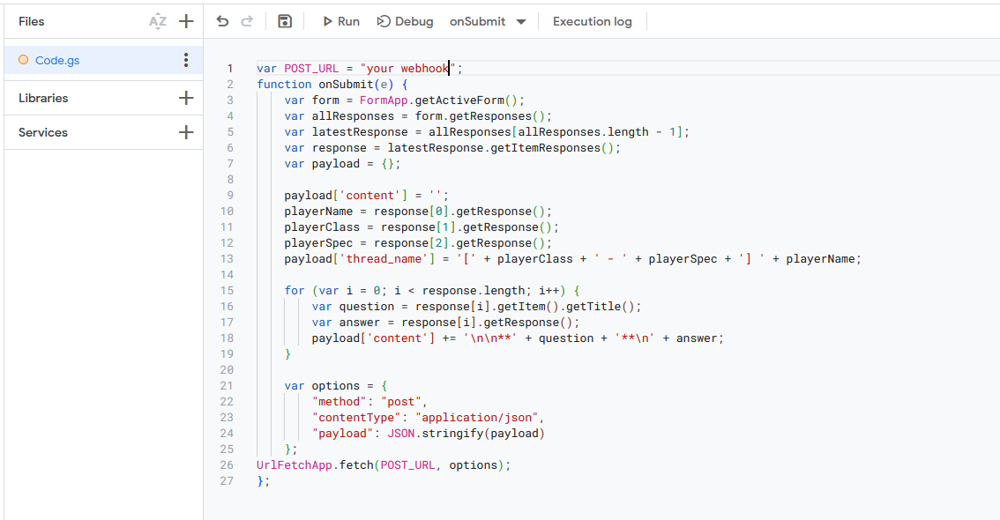
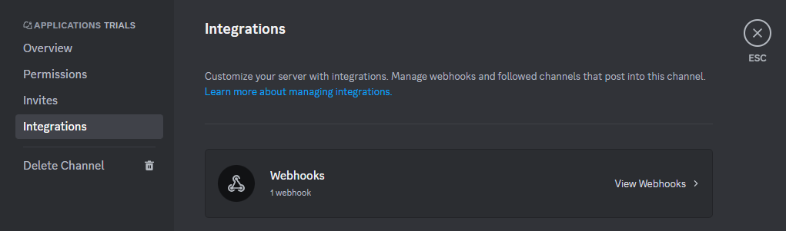
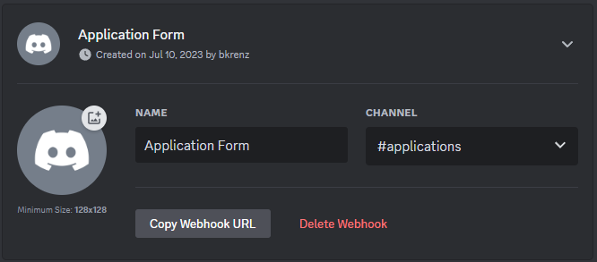
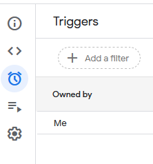
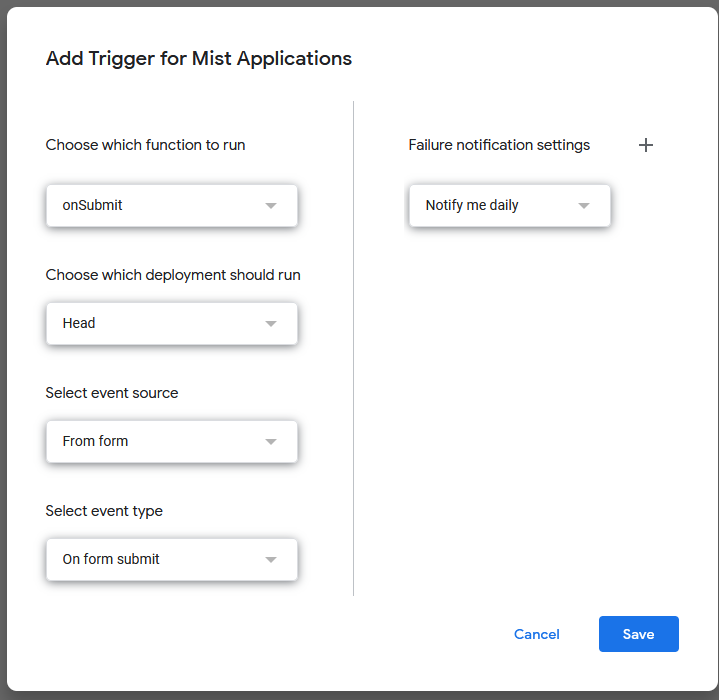
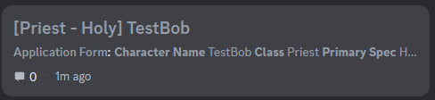

# Auto Post Google Forms Responses to Discord

Most guilds today use a Google Form to handle their recruitment responses, and Discord as the primary communication platform. 
With the addition of Forums as a feature for Discord, it is possible to use a Webhook to automatically upload Form submissions as a Forum Thread.
The [script](script.js) in this repository is the code utilized to do this.
Modification of this script allows for custom formatting to be achieved.

## How To

### 1. Create the Google Form

Create your Google Form as your application.
The script assumes that certain questions are in a certain order to work properly:

1. Player Name 
2. Player Class
3. Player Spec

This allows the script to create a new Thread in a Discord Forum with the format `[Class - Spec] PlayerName`.

### 2. Adding the Script

In the top right corner of the Google Forms page is the Menu.
From this Menu, select the `Script Editor`.

Ensure you are on the Editor page and have `Code.gs` selected.

Paste the [script](script.js) code into the editor.
Don't forget to press the Save button!

### 3. Get the Webhook for your Forum Channel

After creating a Forum Channel in your Discord, you will need a Webhook for it.
This can be acquired by right clicking the channel and selecting `Edit Channel`.
Once there, select the `Webhooks` category in the `Integrations` tab.

Create a new Webhook using the button.
Rename the Webhook to be indicative of what this is, such as `Application Form`.

Click the button `Copy Webhook URL`, and it will save the Webhook URL to your clipboard.
Return to the Script Editor and replace the `your webhook` in the first line of the Script with the URL you just copied.

### 4. Add the Trigger

In the Script Editor window, select the `Triggers` menu (the clock).

In the bottom right corner, select `Add Trigger`.
Change the `Select event type` field to `On form submit`.

### 5. Test it out!

Make sure to give it a test before having new recruits apply.
If successful, you should have a new post created in your Forum that looks like this:

Once it's working, enjoy!